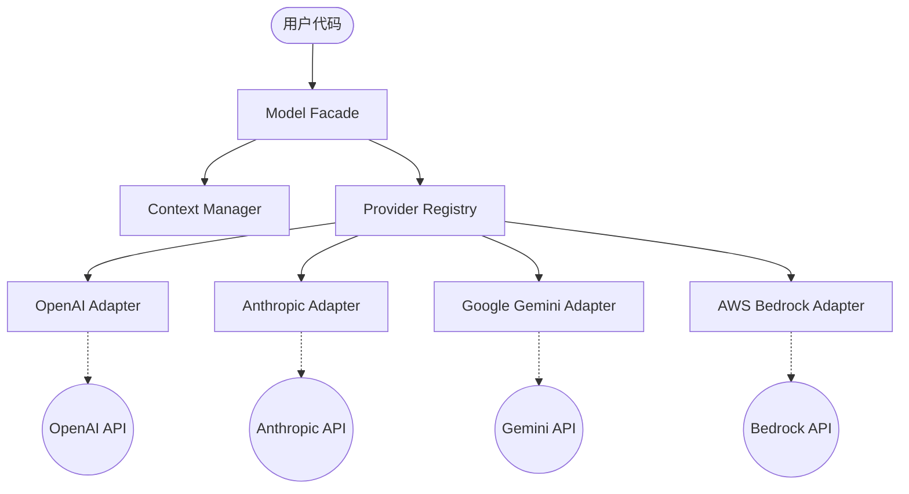

# MengLong Models (模型访问层)

这是 MengLong SDK 的核心访问层，旨在为多模型、多云环境提供一个统一、标准化且高性能的访问入口。

## 架构设计

本层采用了经典的解耦架构，通过 **Facade (外观) 模式** 屏蔽底层不同供应商（OpenAI, Anthropic, Google, AWS 等）的 API 差异。



## 使用的设计模式

- **Facade (外观模式)**: `Model` 类作为统一入口，隐藏了消息归一化、供应商初始化和工具转换的复杂性。
- **Adapter / Strategy (适配器与策略模式)**: `BaseProvider` 定义标准协议，各供应商实现类将 SDK 指令适配为原生 API 调用。
- **Registry (注册表模式)**: `ProviderRegistry` 负责供应商类的发现，支持插件式扩展。
- **Value Object (值对象模式)**: 利用 Pydantic 对 `Message`, `Action`, `Outcome` 进行强类型定义，确保跨平台数据一致性。
- **Decorator (装饰器模式)**: `@tool` 装饰器自动解析函数签名生成 JSON Schema。

## 核心概念

- **`Context`**: 智能对话容器，支持链式调用和快捷消息构造。
- **`Action`**: 模型生成的动作（如工具调用），包含 `id`, `name`, `arguments`。
- **`Outcome`**: 环境返回的结果，用于反馈给模型，通过 `id` 与 `Action` 关联。

## 快速上手

### 1. 基础对话
```python
from menglong.models import Model
from menglong.schemas.chat import Context

model = Model("openai/gpt-4o")

# 链式构造上下文
ctx = Context().user("你好！").assistant("你好，我是您的 AI 助手。").user("请问今天天气如何？")
response = model.chat(ctx)
print(response.text)
```

### 2. 工具调用 (Function Calling)
```python
from menglong.components.tool_component import tool

@tool
def get_weather(city: str):
    """获取城市天气"""
    return {"city": city, "temp": 25}

# 1. 模型生成 Action
import json
response = model.chat("巴黎天气？", tools=[get_weather])
if response.tool_calls:
    action = response.tool_calls[0]
    
    # 2. 执行工具并返回 Outcome
    result = get_weather(**action.arguments)
    
    # 3. 闭环反馈
    ctx = Context().user("巴黎天气？").assistant(tool_calls=[action.model_dump()])
    ctx.tool(tool_id=action.id, name=action.name, content=json.dumps(result))
    
    final_res = model.chat(ctx)
    print(final_res.text)
```

## 架构扩展
- **添加新平台**：在 `providers/` 目录下继承 `BaseProvider`，并使用 `@ProviderRegistry.register("name")` 注册。
- **自定义配置**：通过项目根目录的 `.configs.toml` 文件进行精细化模型参数及 API 密钥配置。
